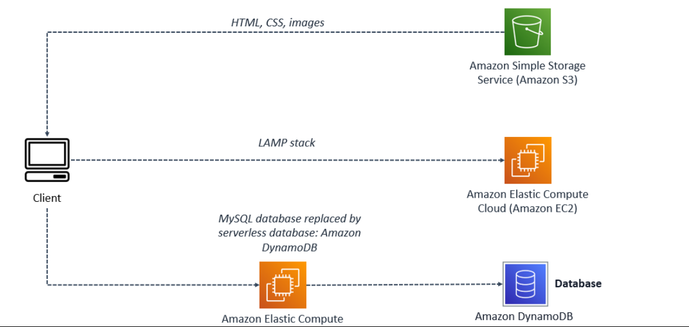

# server-to-serverless-ice-cream-website
Evolution of a website: Going from single server to serverless

Lab Overview
AnyCompany Ice Cream hires you to create and maintain their website. In this lab, you follow the growth of the business and how it evolves their website’s infrastructure.

You start by creating the company’s static website hosted on Amazon Simple Storage Service (S3) that displays the ice cream flavors. The business starts to gain popularity among the locals and flavors start to sell out before the day is up. The business owners ask you to migrate to a server where they can have you push updates. They decide to migrate their static site to Amazon Elastic Compute Cloud (EC2) with a Linux, Apache, MySQL, PHP (LAMP) stack built on it.

This will allow the website to update and react dynamically. Demand for AnyCompany’s ice cream surges after a viral video and the infrastructure and maintenance becomes difficult to manage. To scale with demand, you suggest migrating sections of their LAMP stack to serverless services, starting with the MySQL database. The MySQL database will be replaced with Amazon DynamoDB serverless database.

LAB OBJECTIVES
In this lab, you:

Upload files to Amazon S3 to host a static website.
Migrate the dynamic website hosted on EC2 from using a MySQL database to using Amazon DynamoDB.
Update the DynamoDB table with a new ice cream flavor.
Refresh the website to reveal your new ice cream flavor.

APPLICATION ARCHITECTURE
The application architecture uses the following services:

Static site: Amazon S3 which contains HTML, CSS, and images.
Dynamic site: Amazon EC2 Linux, Apache web server, MySQL database, and PHP (LAMP) stack will come pre installed. This will allow the owner or developer to update the flavors available for the day.
Serverless: Amazon DynamoDB. This will replace the MySQL database and make the database portion serverless.
The architecture has a client accessing Amazon S3, an Amazon EC2 instance with a LAMP stack installed on it, and the same Amazon EC2 instance with the database replaced with Amazon DynamoDB.

Figure: The preceding architecture shows three different ways the client is accessing information. The client can access static content through Amazon S3 which holds the HTML, CSS, and image files. Dynamic content can be accessed through the dynamic site hosted on Amazon EC2. The site has a database, and is able to update content through its server. The last way to access this site is keeping the Amazon EC2 instance, and migrating the database to a serverless database, which is seen in this diagram.

